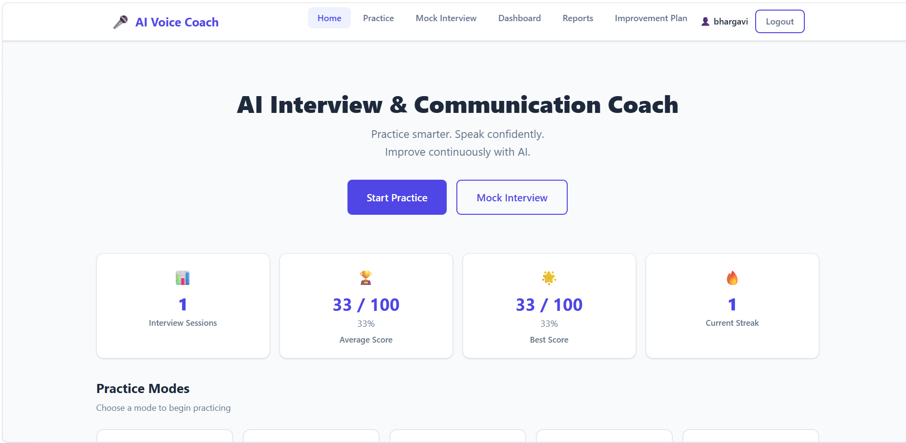
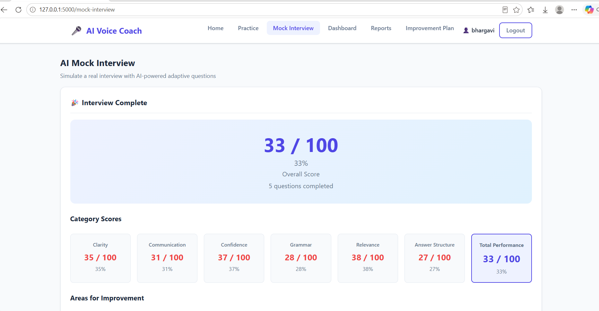
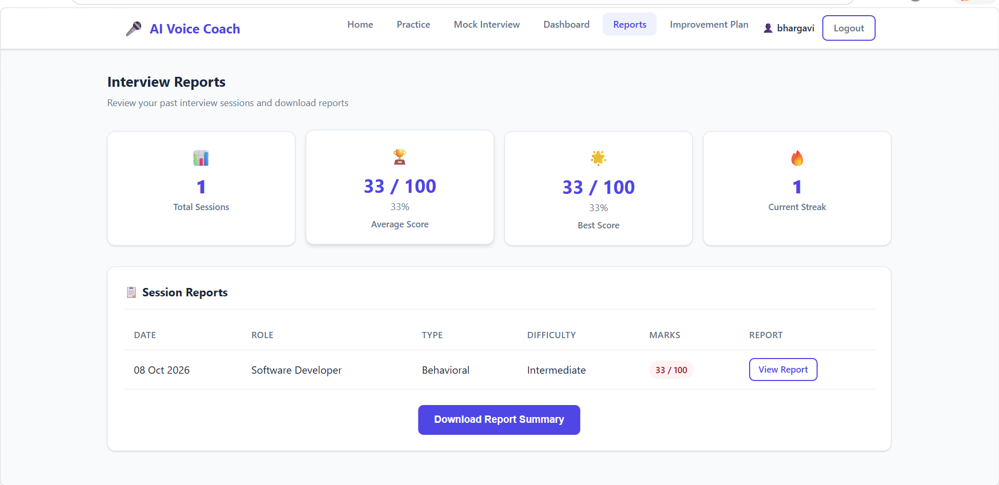
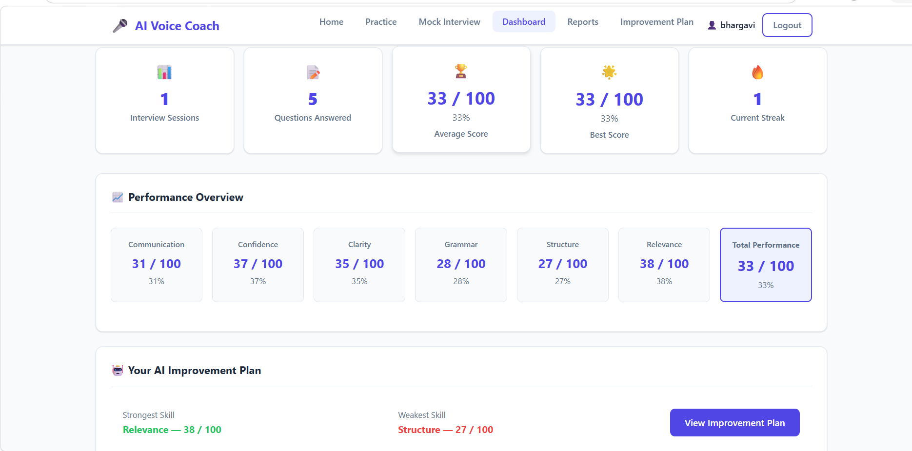

# AI Voice Coach 🎙️

AI Voice Coach is an AI-powered interview preparation platform that helps users practice interviews, receive AI-generated feedback, and improve their communication and technical interview performance.

## 🚀 Features

- 🎙️ AI-powered voice interview practice
- 🤖 Gemini AI integration
- 📝 AI-generated interview questions
- 📊 Interview performance analysis
- 📄 PDF interview reports
- 💾 MySQL database integration
- 👤 User management
- 📈 Performance tracking

## 🛠️ Technologies Used

- Python
- Flask
- MySQL
- Google Gemini API
- HTML
- CSS
- JavaScript
- Jinja2
- ReportLab

## 📸 Screenshots

### Home Page



### Interview Practice



### Performance Report



### Dashboard



## ⚙️ Installation

### 1. Clone the repository

```bash
git clone https://github.com/adepuvijayabhargavi/AI-Voice-Coach.git
cd AI-Voice-Coach
